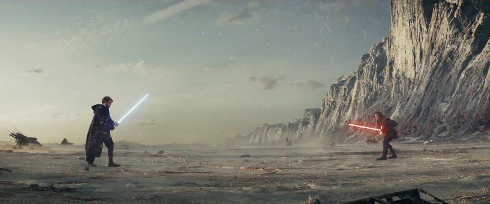
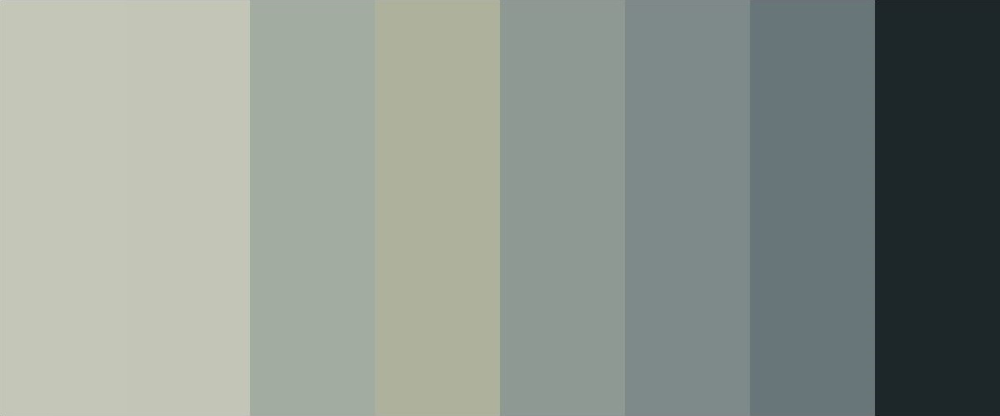
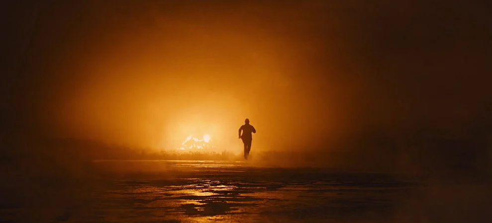
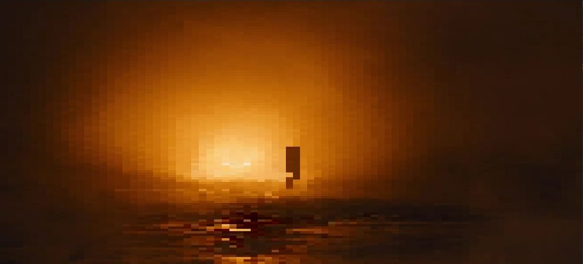

# imageColorTiler

Divides an image into a specified dimensioned grid. Each tile of the grid is filled of the dominant color in the corresponding region of the image.
You can run the script with the following command :
```
python imageColorTiler.py <path-to-image> <columns> <rows>
```

## Examples

Here is a few examples of what this script can achieve :

### Get the dominant color

Get the most dominant color in your image.
This was the original purpose of this script but I decided to tweak it and make it with a grid system.

```
python imageColorTiler.py ./examples/color/original.jpg 1 1
```
Shot from the Blade Runner 2049 (2017):

Dominant color :


### Slice an image 

Slice an image into several band (e.g. for seeing the color repartion through the image)

```
python imageColorTiler.py ./examples/slice/original.jpg 8 1
```
Shot from the Star Wars: The Last Jedi (2017):

Sliced image :


### Pixelate  an image

You can simply pixelate an image 
```
python imageColorTiler.py ./examples/pixel/original.jpg 80 100
```
Shot from the movie Skyfall (2012):

Pixelated image :
